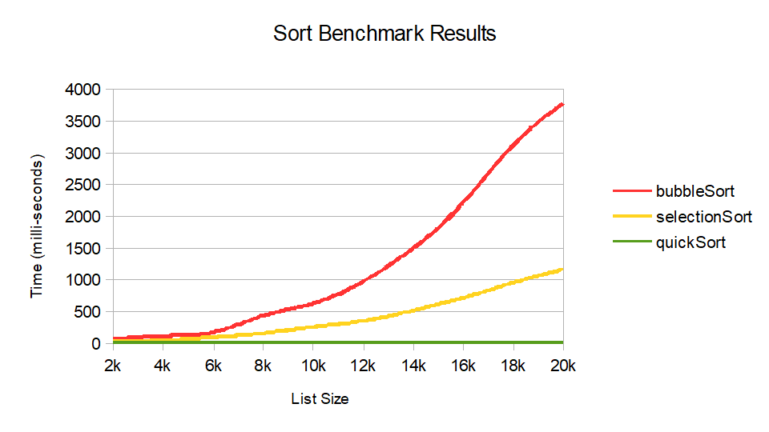

# Sorting Algorithm Benchmark Report

This report benchmarks five common sorting algorithms on randomly generated data in Java:

- **Bubble Sort**
- **Selection Sort**
- **Merge Sort**
- **Quick Sort**
- **Collections.sort (TimSort)**

Each algorithm was tested on randomly generated lists of increasing size (from 2,000 to 20,000 elements). The benchmark measures the time taken by each sort in milliseconds, and results are stored in a CSV file and visualized as a line graph.

---

## 📊 Benchmark Results

**Data Source:** [`benchmarks.csv`](./benchmarks.csv)

| Sort Name       | 2k     | 4k     | 6k     | 8k     | 10k    | 12k    | 14k    | 16k    | 18k    | 20k    |
|-----------------|--------|--------|--------|--------|--------|--------|--------|--------|--------|--------|
| **Bubble Sort**     | 54.491 | 111.657 | 168.656 | 430.319 | 625.142 | 970.704 | 1495.636 | 2209.948 | 3125.573 | 3770.541 |
| **Selection Sort**  | 28.869 | 40.746  | 90.083  | 152.149 | 249.947 | 347.360 | 511.992  | 712.590  | 949.183  | 1164.839 |
| **Merge Sort**      | 7.794  | 1.546   | 2.056   | 2.698   | 3.598   | 4.200   | 5.271    | 10.688   | 5.475    | 6.119    |
| **Quick Sort**      | 2.794  | 0.576   | 0.969   | 1.113   | 1.597   | 1.744   | 2.154    | 2.671    | 3.092    | 3.807    |
| **Collections.sort**| 3.098  | 4.914   | 5.207   | 3.890   | 5.301   | 8.874   | 2.950    | 3.277    | 3.968    | 4.595    |

---

## 📈 Line Graph of Sorting Performance

The following graph visualizes the time taken (in milliseconds) for each sorting algorithm as the input size increases:

> **X-axis:** List Size (2k → 20k)  
> **Y-axis:** Time in milliseconds

---

## 🛠️ Methodology

- A custom Java program generated random `Pair` objects (`int key`, `String value`).
- For each list size (2,000 to 20,000), the same random data was copied and passed to five different sorting methods.
- Timing was performed using `System.nanoTime()` and converted to milliseconds.
- Results were rounded to 3 decimal places and saved in `benchmarks.csv`.
- The graph was created in **OpenOffice Calc** using the benchmark data.

---

## 📁 Included Files

- `benchmarks.csv` — Raw benchmark data
- `benchmarks.png` — Line graph visualizing performance
- `benchmark_report.md` — This summary report

---

## 🧠 Conclusion

- **Bubble Sort** and **Selection Sort** scale poorly with input size due to their `O(n²)` time complexity.
- **Merge Sort**, **Quick Sort**, and **Collections.sort()** scale much better and are suitable for larger inputs.
- `Collections.sort()` (which uses TimSort) performed consistently and is a solid general-purpose sorting method.

